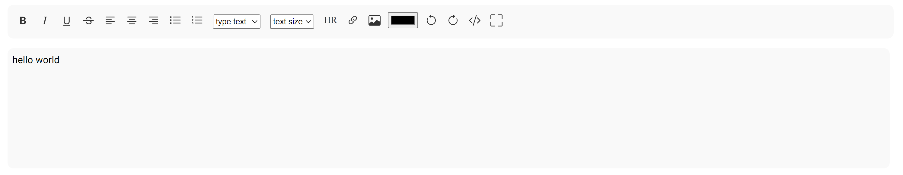

# ✍ writer.js

writer.js is a simple text editor in the web

## ❓ About writer.js:
This is a simple and lightweight editor for the web

## 💻 How to use writer.js:
1. download writer.js from github
2. Add script and style writer.js in head tag:
```
<link rel="stylesheet" href="writer.js/css/style.css">
<script src="writer.js/js/script.js"></script>
```
3. Create a div tag with the desired id and Create an iframe tag with the desired id and writer-js class inside it.
```
<div id="textEditor">
    <iframe id="writer-js" class="writer-js"></iframe>
</div>
```
4. Open a script tag under the body and run the createEditor function
```
createEditor(lang, iframe id, div id, default value, style)
```
> This function takes multiple inputs. The first input is the language of your editor. We support English and Farsi languages. The second and third inputs is your iframe ID and your div ID. The fourth input, which is optional, specifies the default text inside the editor. The fifth value is the styles you want for the text inside the editor.
for example:
```
createEditor('en', 'writer-js', 'textEditor', 'hello world', 'a{color: blue;}')
```
## 📃 How to get the content?
Run output() function.
After that, the content is available in a textarea with the name and ID output + iframe id.
